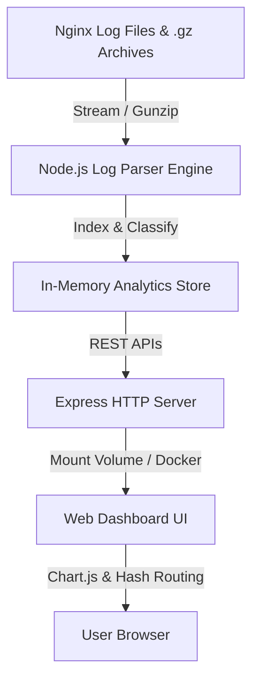

# ⚡ Nginx Log Insights & Threat Analytics Dashboard

A high-performance, dockerized Nginx log parser, forensic analytics engine, and real-time interactive web dashboard. Built with Node.js, Express, Vanilla JS, and Chart.js.


---

## 🌟 Key Features

### 🚀 High-Performance Log Ingestion
- **Automatic Streaming & Decompression**: Dynamically reads and parses both uncompressed `.log` files and compressed `.gz` archives on startup without disk extraction.
- **Combined & Error Format Support**: Robust regex parsers handle standard Nginx combined access logs, error logs, and custom formats.

### 📊 Deep Forensic Analytics
- **Search Engine Crawler Audits**: Classifies over 15 crawler bot families (Googlebot, Bingbot, Yandex, Baidu, Ahrefs, Semrush, MJ12bot, GPTBot, ClaudeBot, Perplexity AI, Applebot, cURL/Python scripts).
- **Googlebot Failure Tracking**: Isolates genuine Googlebot crawls returning 4xx/5xx status codes to protect SEO rankings.
- **Single IP Deep-Dive Audit (`#ip-audit`)**: Instant forensic lookup for any client IP address displaying matched requests, status code distribution, top targeted paths, and user-agent history.
- **Access Denied & Vulnerability Threat Probe Detector**: Detects and groups 403 Forbidden events and malicious scanner probes targeting sensitive paths (`.env`, `phpinfo`, `wp-admin`, `credentials.json`, `.git`).

### 🎛️ Interactive Web Dashboard
- **URL Hash Sync (`#crawlers`, `#googlebot`, `#ip-audit`, etc.)**: Tab states stay perfectly in sync with the browser URL and support back/forward navigation.
- **Persistent Global Filters (`localStorage`)**: Custom `startDate`, `endDate`, and HTTP status code checkboxes (`2xx`, `3xx`, `403`, `404`, `5xx`) automatically persist across browser reloads.
- **One-Click Copy API URL**: Instantly generates and copies the exact JSON API query endpoint matching active filters.

---

## 🏗️ Architecture Overview



---

## 📁 Modular Directory Structure

```text
nginx/
├── models/
│   └── logStore.js            # Shared In-Memory Log Store & Gunzip Parser Engine
├── routes/
│   ├── summary.js             # Overview Stats & Paginated Log APIs (/api/summary, /api/logs)
│   ├── analytics.js           # Bot Analytics, Googlebot Audits, 403 Threat Probes
│   └── ipAudit.js             # Paginated Single IP Deep-Dive Audit (/api/ip-audit)
├── public/                    # Web Dashboard Frontend
│   ├── index.html             # Single-Page Dashboard Layout & Multi-Tab Containers
│   ├── style.css              # Dark Mode Design System & Badges
│   └── app.js                 # URL Hash Router, LocalStorage Filters, Chart.js Integrations
├── logs/                      # Raw Nginx Log Files (*.log, *.gz)
├── server.js                  # Express Entry Point & Modular Route Mounting
├── Dockerfile                 # Node.js Container Definition
├── docker-compose.yml         # Multi-Volume Docker Development Setup
├── nginx_redirects.conf       # SEO 301 Permanent Redirect Configuration Template
├── fail2ban_nginx_scanners.conf # Fail2ban Security Jail & Filter Rules Template
└── README.md
```

---

## 🛠️ Quick Start with Docker Compose


### Prerequisites
- [Docker](https://www.docker.com/) & Docker Compose installed on your system.

### Running the Application

1. Place your Nginx log files (`access.log*`, `error.log*`, `*.gz`) inside the `./logs` directory.
2. Launch the stack:
   ```bash
   docker-compose up -d --build
   ```
3. Open your browser and navigate to:
   **[http://localhost:3080](http://localhost:3080)**

---

## 📡 REST API Reference

| Endpoint | Method | Description | Sample Query Parameters |
|----------|--------|-------------|-------------------------|
| `/api/summary` | `GET` | Overall request metrics, status code totals, bandwidth | `startDate`, `endDate`, `statuses` |
| `/api/logs` | `GET` | Paginated raw log entries with live keyword search | `page`, `limit`, `search`, `status`, `logType` |
| `/api/analytics/bots` | `GET` | Bot crawler breakdown by family & bandwidth | `startDate`, `endDate` |
| `/api/analytics/googlebot` | `GET` | Googlebot crawl audit & failed requests | `startDate`, `endDate` |
| `/api/analytics/status-matrix` | `GET` | Full HTTP status code matrix & sample URLs | `startDate`, `endDate` |
| `/api/analytics/access-denied` | `GET` | 403 Forbidden events & top offending scanner IPs | `startDate`, `endDate` |
| `/api/ip-audit` | `GET` | Deep forensic audit for a single IP | `ip=185.191.171.16` |

---

## 🛡️ Production Security & SEO Tweaks Included

The workspace includes pre-generated production configuration templates:

1. **[nginx_redirects.conf](file:///Users/ankit/Downloads/nginx/nginx_redirects.conf)**: Ready-to-use 301 Permanent Redirect rules for deleted routes (like `/exam-details/neet/all`) to preserve SEO authority.
2. **[fail2ban_nginx_scanners.conf](file:///Users/ankit/Downloads/nginx/fail2ban_nginx_scanners.conf)**: Fail2ban jail filter to automatically block fake crawler IPs probing for `.env`, `credentials.json`, or admin paths.

---

## 📄 License
This project is licensed under the MIT License.
